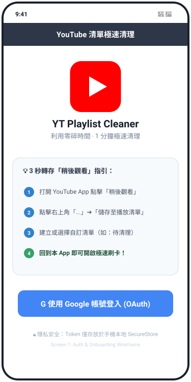
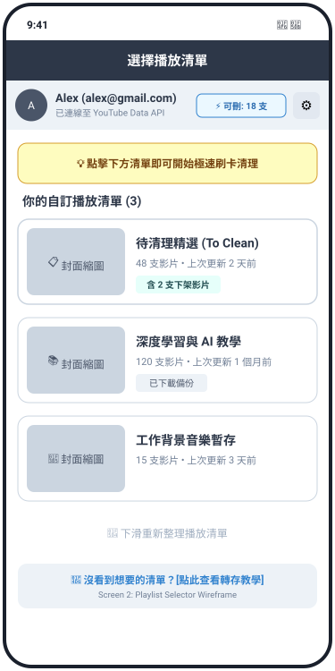
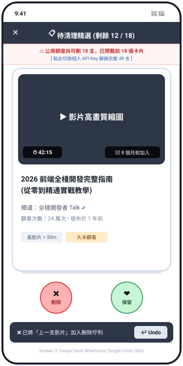
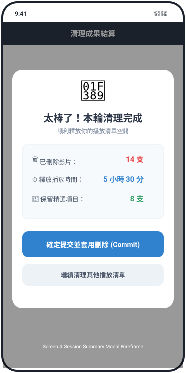
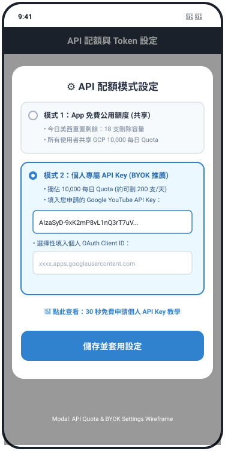

# 📄 產品需求規格書 (PRD) - YouTube 零碎時間極速清理 App

| 專案名稱 | YouTube 播放清單極速清理 App (YT Playlist Cleaner) |
| :--- | :--- |
| **文件版本** | v1.0.0 (Final Spec) |
| **建立日期** | 2026-09-02 |
| **目標平台** | iOS / Android (Expo / React Native) |
| **架構模式** | Local-First / Serverless (無後端伺服器架構) |

---

## 🎯 1. 執行摘要與產品願景 (Executive Summary)

### 1.1 痛點分析
廣大 YouTube 使用者經常將感興趣的影片加入「稍後觀看」或各類主題播放清單，但隨著時間累積，清單長度動輒數百支，造成嚴重的**「數位堆積與決策疲勞」**。在等公車、排隊、搭捷運等 1~3 分鐘的零碎時間內，傳統條列式的 YouTube 清單介面資訊密度過高、認知負擔重，無法提供順暢的快速篩選體驗。

### 1.2 產品定位
一款專為**零碎時間**打造的輕量化手機 App。透過類似 **Tinder 的直覺單手滑卡手勢（左滑刪除、右滑保留）**，將複雜的清單整理轉化為極低心智負擔的單一二元決策，協助使用者高效率瘦身播放清單。

---

## 👥 2. 目標使用者與核心情境 (Target Persona & Use Cases)

- **目標 Persona**：重度 YouTube 使用者、資訊收集狂、時間管理追求者。
- **核心使用情境**：
  - **排隊/等車時 (1 分鐘)**：打開 App，對著「待清理」清單極速左滑刪除 10 支早已不想看的長影片。
  - **睡前/休息時 (3 分鐘)**：滑完 20 張卡片，查看結算畫面：「恭喜釋放 4.5 小時未看影片！」，獲得正向心理滿意度。

---

## 📱 3. UX 畫面流程與 Wireframe 規範 (Detailed UX Specifications)

本產品由 4 個核心畫面與 1 個 API 設定彈窗構成。所有畫面 Wireframe 如下：

### 3.1 Screen 1: OAuth 登入與轉存引導頁 (Auth & Onboarding)

提供單純的 Google OAuth 2.0 登入，並附帶「稍後觀看 ➔ 自訂清單」3 秒轉存圖文指引（因 YouTube API 封鎖原生稍後觀看，需引導使用者轉存至自訂清單）。



- **互動細節**：
  - 點擊 `G 使用 Google 帳號登入` 觸發 `expo-auth-session` 進行授權。
  - 若 `expo-secure-store` 已有有效 Token，0.5 秒內自動跳轉至 Screen 2。

---

### 3.2 Screen 2: 播放清單選擇頁 (Playlist Selector)

展示使用者所有自訂播放清單，並於頂部醒目標示「當日 API 可刪除餘額」與「設定入口」。



- **互動細節**：
  - **Header 右側**：顯示 `⚡ 可刪: X 支` 配額徽章與 `⚙️ 設定` 圖示。
  - **清單卡片**：點擊任意播放清單，背景觸發自動預處理（Auto-Pruning），並載入 Screen 3。
  - **下拉重整**：支援 Swipe-to-Refresh 更新清單列表。

---

### 3.3 Screen 3: Tinder 刷卡主畫面 (Swipe Deck Engine)

核心極速清理引擎。採用 16:9 高畫質影片卡片，僅顯示標準數字影片時長與加入時間。



- **互動與手勢**：
  - **左滑 (Left Swipe)**：刪除影片，卡片飛出，加入待刪除佇列。
  - **右滑 (Right Swipe)**：保留影片，卡片飛出，不作改動。
  - **配額截斷 Banner**：若公用配額不足，頂部醒目提示並提供「一鍵切換個人 API Key」連結。
  - **單一 Undo Toast (Single-Slot Undo)**：下方浮現已刪除提示與 `[↩ Undo]` 按鈕。**當使用者滑動下一張卡片時，上一張 Undo 立即失效覆蓋**。

---

### 3.4 Screen 4: 清理成果結算頁 (Session Summary Modal)

當刷完卡片或主動點擊離開時跳出，展現心理成就感數據，並發起背景批次刪除 API。



- **核心數據**：
  - 🗑️ 已刪除影片數
  - ⏱️ 釋放總播放時間（以卡片時長累加）
  - 💖 保留精選數量
- **提交機制**：點擊 `確定提交並套用刪除` 發起背景批次 `DELETE` 請求。

---

### 3.5 Modal: API 配額與 BYOK 設定頁 (Quota & BYOK Settings)

允許使用者在 App 公用配額用盡時，無縫切換為個人專屬 Google API Key (BYOK)，解鎖 10,000 每日獨立配額。



---

## 🛠️ 4. 系統架構與狀態管理 (System Architecture)

### 4.1 技術棧 (Tech Stack)
- **前端框架**：Expo (React Native) + TypeScript
- **狀態管理**：Zustand
- **本地安全存儲**：`expo-secure-store` (OAuth Refresh/Access Tokens)
- **本地數據快取**：`AsyncStorage` ( Session 佇列、配額計數、歷史統計)

### 4.2 Zustand Store 結構設計

```typescript
// 1. Auth Store
interface AuthStore {
  accessToken: string | null;
  refreshToken: string | null;
  userProfile: { name: string; email: string; avatar: string } | null;
  apiMode: 'PUBLIC_SHARED' | 'BYOK_PERSONAL';
  personalApiKey: string | null;
  setTokens: (tokens: any) => void;
  setBYOKKey: (key: string) => void;
}

// 2. Swipe Deck Store
interface SwipeDeckStore {
  activeDeck: YouTubePlaylistItem[];       // 當前可刷卡片
  autoDeletedQueue: YouTubePlaylistItem[];  // 自動剔除之已下架/私人影片
  pendingDeleteQueue: YouTubePlaylistItem[];// 使用者手動左滑刪除
  keptQueue: YouTubePlaylistItem[];        // 使用者手動右滑保留
  lastSwipedItem: YouTubePlaylistItem | null; // 單一 Undo 暫存 Slot

  // Actions
  initDeck: (items: YouTubePlaylistItem[]) => void;
  swipeLeft: (item: YouTubePlaylistItem) => void;
  swipeRight: (item: YouTubePlaylistItem) => void;
  undoLastSwipe: () => void;
  commitDeletions: () => Promise<BatchResult>;
}
```

---

## 🛡️ 5. API 配額防爆與護欄引擎 (Quota Protection Engine)

### 5.1 YouTube Data API v3 消耗權重
- `playlists.list` / `playlistItems.list`: **1 unit** / call
- `playlistItems.delete`: **50 units** / call

### 5.2 重置時間與容量計算公式
- **重置時間基準**：太平洋時間 (Pacific Time, PT) 每日午夜 00:00（約台灣時間 15:00/16:00）。
- **安全預留額度 (`SAFETY_RESERVE`)**：500 units（約 10 次刪除與重試安全緩衝）。
- **今日最大可刪數計算公式**：
  $$\text{MaxDeletableCount} = \left\lfloor \frac{\text{DAILY\_LIMIT} - \text{QuotaUsedToday} - \text{SAFETY\_RESERVE}}{50} \right\rfloor$$

### 5.3 容量自動截斷 (Deck Clamping)
若該清單包含 $M$ 支影片，但 $\text{MaxDeletableCount} = N < M$，系統自動將載入 Deck 的卡片張數限制為 $N$ 張，並於 Screen 3 提示引導切換 BYOK 個人 Key，**100% 杜絕刷完卻無法刪除的劣質體驗**。

---

## ⚠️ 6. 邊界條件與例外處理矩陣 (Edge Case Matrix)

| 邊界場景 | 觸發條件 | 系統處置與 UX 行為 |
| :--- | :--- | :--- |
| **下架/私人影片** | `snippet.title` 為 'Deleted video' 或 'Private video' | **自動預處理**：不呈現卡片，直接放入 `autoDeletedQueue`，刷完自動於 Screen 4 提示併同刪除。 |
| **直播/未開播影片** | 影片屬於 Live Stream 或無標準時長 | **自動保留**：系統自動存入 `keptQueue` 並跳過，Screen 3 時長標籤 100% 僅需處理標準數字。 |
| **重複影片** | 同一清單存在相同影片 | 全系統一律使用 YouTube 唯一的 **`playlistItemId`** 作為 Key，禁止使用 `videoId`。 |
| **連滑 Undo 失效** | 使用者連續滑動第二張卡片 | **Single-Slot Undo**：舊 Undo 立即失效並被新卡片覆蓋，保持邏輯極簡。 |
| **中途斷線 / 閃退** | 滑卡中途網路中斷或 App 關閉 | **即時持久化**：每次左滑區域性將 `pendingDeleteQueue` 寫入 `AsyncStorage`，下次開啟 App 跳出恢復提交提示。 |
| **刪除返回 404** | 影片已在外部被刪除 | 背景 Worker 補捉 `404 Not Found` 視為刪除成功，繼續執行佇列，不中斷批次流程。 |

---

## 🚀 7. 非功能性需求 (Non-Functional Requirements)

1. **效能指標**：
   - 滑卡手勢動畫須達到 **60 fps**（使用 React Native Reanimated 3）。
   - 卡片手勢觸發延遲 $< 150\text{ms}$。
2. **安全與隱私**：
   - 零伺服器架構，Google OAuth Tokens 必須存於 iOS Keychain / Android Keystore 加密區（`expo-secure-store`）。
3. **無障礙與跨平台**：
   - 支援 iOS 與 Android 雙平台適配，螢幕寬度自動伸縮。

---

## 📅 8. 專案目錄結構規劃 (Project Directory Structure)

```
yt-playlist-cleaner/
├── docs/
│   ├── PRD.md
│   └── wireframes/          # 5 大畫面 SVG Wireframe 圖像檔
│       ├── screen1_auth.svg
│       ├── screen2_playlist.svg
│       ├── screen3_swipe.svg
│       ├── screen4_summary.svg
│       └── modal_settings.svg
├── src/
│   ├── api/                 # YouTube Data API v3 Client & Quota Engine
│   ├── components/          # SwipeCard, UndoToast, QuotaBadge, SummaryModal
│   ├── hooks/               # useYouTubeAuth, useSwipeDeck
│   ├── screens/             # AuthScreen, PlaylistScreen, SwipeScreen
│   ├── stores/              # Zustand AuthStore, SwipeDeckStore
│   └── utils/               # Quota Math, Date/Duration Formatters
├── app.json
└── package.json
```
